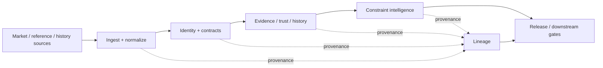

# HYDRA

**Market Intelligence Data Platform**

> Turn fragmented market data into traceable intelligence.

HYDRA is a data-engineering project built around a simple premise: **correctness, authority, provenance, and failure behavior belong inside the pipeline, not in cleanup after the fact.**

The platform ingests heterogeneous market/reference/history data, converts it into controlled internal representations, enforces contract-bound handoffs, preserves lineage, and produces downstream intelligence only when the available evidence is authorized to support it.

## Architecture



**Core data flow**

`Source → normalized records → contracts → lineage/history → constraint/intelligence output → release gate`

## What the engineering demonstrates

- **Multi-source ingestion and canonicalization** with explicit source accounting.
- **Contract-bound handoffs** rather than loose dictionary passing between stages.
- **Deterministic identity and provenance** so outputs remain traceable to their evidence.
- **Replay and reverse-trace behavior** across integrated pipeline seams.
- **Named defect handling** with bounded repair and rerun proof.
- **Fail-closed authority checks** when required semantic values cannot be established legitimately.
- **Constraint semantics that preserve uncertainty** instead of forcing every observation into a confident conclusion.

## Technical proof

| Area | Evidence | Scope |
|---|---|---|
| Real data canonicalization | 3,353 option-chain source records loaded, 0 source errors, 17,766,662 canonical rows written | **REAL DATA PROCESSING** |
| Integrated replay + lineage | exact replay match, stable lineage digest, reverse trace complete, why trace complete | **SYNTHETIC / SHADOW INTEGRATION** |
| Defect → minimum repair → rerun | CI-TEST-004 returned `PASS_REPAIRED_CI_TEST_004`; frozen baseline remained unchanged | **SYNTHETIC / SHADOW INTEGRATION** |
| Missing authority → block | CI-TEST-008 could not satisfy the native T5→T6 contract without invented values; `semantic_values_invented=false` | **SYNTHETIC / SHADOW INTEGRATION** |

Start here: **[Technical proof](docs/TECHNICAL_PROOF.md)**.

## Representative constraint example

A recruiter-readable constraint case is documented in **[Constraint case](docs/CONSTRAINT_CASE.md)**.

The important behavior is not a dramatic label. It is the boundary around the label:

```text
AVAILABLE EVIDENCE
      ↓
normalize + identify + trace
      ↓
authority / scope check
      ↓
SUPPORTED:       LOCAL BOTTLENECK
NOT AUTHORIZED:  SYSTEMIC SHORTAGE
```

The representative case intentionally refuses the broader conclusion because narrow source coverage and pricing pressure do not establish systemic physical scarcity.

## Engineering principles

1. **Evidence is not authority.** Discoverable data is not automatically authorized input for every downstream field.
2. **Identity is governed.** Classification does not mint canonical identity.
3. **Lineage survives transformation.** A conclusion should be reversible back to its source and transformation path.
4. **Ambiguity is a valid output.** Unknown, blocked, and unclassifiable states are preferable to invented certainty.
5. **Repairs are defect-scoped.** Fix the smallest demonstrated problem, then rerun the same test.
6. **Frozen baselines stay frozen.** Test/repair overlays do not silently rewrite the authoritative baseline.

## Testing

HYDRA's recruiter-facing test story is intentionally compact:

```text
contract check
    ↓
integrated seam test
    ↓
named defect
    ↓
minimum bounded repair
    ↓
rerun same seam
    ↓
PASS  or  BLOCKED_BY_MISSING_AUTHORITY
```

See **[Technical proof](docs/TECHNICAL_PROOF.md)** for the short receipts behind that loop.

## Real vs. synthetic

HYDRA does **not** present all evidence under one blurry “production” label.

- The options-chain canonicalization example is grounded in a real historical dataset.
- The current cross-thread integration receipts shown here are explicitly **synthetic/shadow**.
- The representative constraint case is explicitly **representative / non-live**.
- No production deployment, live production constraint feed, or live ML execution is claimed by this front door.

Full scope statement: **[Real vs. synthetic](docs/REAL_VS_SYNTHETIC.md)**.

## Repository map

This public front door is deliberately small:

```text
README.md                     ← start here

docs/
  ARCHITECTURE.md             ← system boundaries and data flow
  TECHNICAL_PROOF.md          ← strongest recruiter-safe evidence
  CONSTRAINT_CASE.md          ← one understandable end-to-end example
  REAL_VS_SYNTHETIC.md        ← claim boundaries
  REPOSITORY_MAP.md           ← where a reviewer should look next

evidence/
  OPTIONS_CANONICALIZATION_RECEIPT.txt
  CI_TEST_004_REPAIR_RECEIPT.txt
  CI_TEST_005_LINEAGE_RECEIPT.txt
  CI_TEST_008_AUTHORITY_BLOCK.json
  EVIDENCE_MANIFEST.json
```

The public entry point should **not** lead with internal ZIP factories, historical version trees, stale handoffs, or sealed-lane archaeology.

## Run / demo path

There is **no public production runner claimed here**. That is intentional.

The strongest truthful inspection path today is:

1. Read this README.
2. Open **[Technical proof](docs/TECHNICAL_PROOF.md)**.
3. Inspect the four compact evidence files under `evidence/`.
4. Read **[Constraint case](docs/CONSTRAINT_CASE.md)** for the end-to-end engineering story.

A runnable public demo should be added only when a safe, bounded entrypoint is independently verified. HYDRA will not invent one for presentation value.

---

### Recruiter takeaway

**HYDRA is a market-intelligence data platform that treats source identity, contracts, lineage, testing, defect handling, and authority boundaries as first-class data-engineering problems.**
