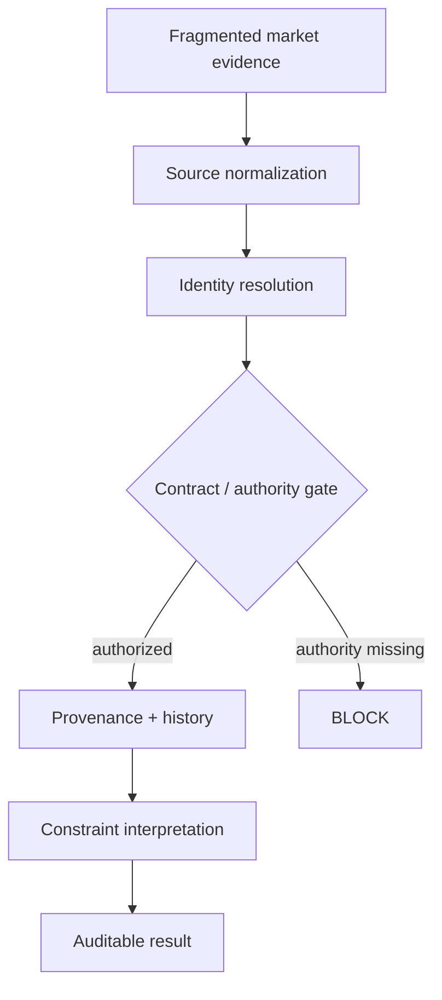

# HYDRA

**Market Intelligence & Data Engineering System**

> Turn fragmented market data into traceable intelligence.

**Public repository:** https://github.com/HYDRADATAAI/Hydra-Website
**Core engineering repository:** https://github.com/HYDRADATAAI/Hydra  
**Release note:** this README is the recruiter-facing repository front door; website deployment state is tracked separately from local release-candidate packaging.

HYDRA is a data-engineering portfolio project built around controlled ingestion, explicit contracts, deterministic identity, provenance, lineage, and auditable downstream decisions. The public repository path is intentionally compact: it shows the architecture and the strongest inspectable proof without exposing internal version archaeology as the front door.

## What it does

HYDRA models a pipeline that moves fragmented market, reference, and historical evidence through controlled normalization, identity resolution, contract/authority gates, provenance/history linkage, and downstream constraint interpretation.

A core design rule is simple: **discoverable data is not automatically authorized data**. If a downstream field has no proven owner or permitted derivation, the handoff blocks rather than inventing a value.

## Architecture



See [`docs/ARCHITECTURE.md`](docs/ARCHITECTURE.md).

## Data flow

`source evidence → normalized records → canonical identity → authority check → lineage/history → constraint interpretation → auditable result`

## Engineering principles

- explicit authority and field ownership;
- deterministic identity and bounded canonicalization;
- provenance and forward/reverse lineage;
- contract-bound handoffs;
- testable, replayable transformations;
- quarantine and release-gate propagation;
- minimum defect-scoped repair;
- **blocked rather than fabricated outputs**.

## Technical proof

The public proof path deliberately uses small artifacts rather than giant logs.

| Evidence | Public label | Engineering lesson |
|---|---|---|
| `evidence/CI_TEST_004_PUBLIC_EXCERPT.json` | SYNTHETIC / SHADOW | A named cross-component defect was repaired and rerun to PASS without mutating the canonical baseline. |
| `evidence/CI_TEST_006_PUBLIC_EXCERPT.txt` | SYNTHETIC / SHADOW | A quarantined upstream object remained blocked through the downstream release gate while lineage/provenance were preserved. |
| `evidence/CI_TEST_008_PUBLIC_EXCERPT.json` | SHADOW | Required handoff semantics lacked proven authority, so the pipeline blocked and invented no semantic values. |

See [`docs/EVIDENCE_INDEX.md`](docs/EVIDENCE_INDEX.md).

### Runnable data-engineering pipeline

The core repository now also includes a runnable **SYNTHETIC / NON-LIVE** data-engineering sample:

- [`market-data-pipeline-sample/`](https://github.com/HYDRADATAAI/Hydra/tree/main/market-data-pipeline-sample) — CSV ingestion → strict contract check → normalization → deterministic identity → provenance → quarantine → JSONL / CSV;
- [`pipeline.py`](https://github.com/HYDRADATAAI/Hydra/blob/main/market-data-pipeline-sample/src/hydra_market_pipeline/pipeline.py) — row validation, source-symbol normalization, UTC normalization, provenance hashing, duplicate detection, and quarantine decisions;
- [`test_pipeline.py`](https://github.com/HYDRADATAAI/Hydra/blob/main/market-data-pipeline-sample/tests/test_pipeline.py) — deterministic rerun, CSV/JSONL equivalence, provenance, quarantine, no-silent-loss, and file-level contract tests;
- [`test_contract_files.py`](https://github.com/HYDRADATAAI/Hydra/blob/main/market-data-pipeline-sample/tests/test_contract_files.py) — proves the committed input/output contract files match runtime-required CSV columns and emitted normalized/quarantine record shapes;
- [Market data pipeline CI](https://github.com/HYDRADATAAI/Hydra/actions/workflows/market-data-pipeline.yml) — runs directly from committed source, executes the synthetic fixture, verifies the manifest, and publishes generated outputs as a workflow artifact.

The committed synthetic fixture produces **3 accepted / 4 quarantined** rows by design. Contract files are regression-tested against runtime behavior so the public schemas cannot silently drift away from the implementation. The sample is evidence of pipeline engineering, not a live market-data feed.

### Inspectable implementation

The small public receipts above are paired with a focused source example in the core repository:

- [`t6-fail-closed-validator/`](https://github.com/HYDRADATAAI/Hydra/tree/main/t6-fail-closed-validator) — source-only, dormant fail-closed validator component;
- [`handoff.py`](https://github.com/HYDRADATAAI/Hydra/blob/main/t6-fail-closed-validator/src/hydra_t6_failclosed/handoff.py) — candidate-only handoff validation and authority-smuggling detection;
- [`test_camelcase_smuggling.py`](https://github.com/HYDRADATAAI/Hydra/blob/main/t6-fail-closed-validator/tests/test_camelcase_smuggling.py) — focused regression proof.

The component is intentionally presented as inspectable source, not as an activated live production runtime.

## Representative constraint example

The website includes a **REPRESENTATIVE / NON-LIVE** constraint walkthrough:

`fragmented evidence → normalize → identity → authority → provenance/history → interpretation → result`

The example demonstrates a bounded conclusion: evidence may support a local bottleneck without justifying a broader systemic shortage claim. The case study is intentionally representative and is not presented as live production detection.

Open `constraint-case-study-v2.html` in the website export for the full walkthrough.

## Testing

Public-safe control evidence demonstrates patterns including:

- integrated seam validation;
- bounded repair + rerun;
- deterministic regeneration/replay;
- quarantine propagation;
- forward and reverse lineage checks;
- baseline immutability pins;
- fail-closed authority checks.

## Real vs synthetic

Public labels are mandatory, not cosmetic.

- **REPRESENTATIVE**: illustrative market evidence, normalization, identity mapping, and constraint output used in the case study.
- **SYNTHETIC / SHADOW**: control-plane and integration receipts shown as technical proof.
- **NOT CLAIMED**: live production operation, proven real-world constraint detection, production promotion, or production ML execution.

See [`docs/REAL_VS_SYNTHETIC.md`](docs/REAL_VS_SYNTHETIC.md).

## Repository map

```text
README.md                         recruiter front door
docs/ARCHITECTURE.md             public architecture
docs/EVIDENCE_INDEX.md           proof guide
docs/REAL_VS_SYNTHETIC.md        claim boundary
docs/PUBLIC_CLAIM_BOUNDARIES.md  public language controls
evidence/                         public-safe receipts
constraint-case-study-v2.html    representative case study
index.html                       recruiter website front door
```

## Run / demo path

This public export is a **static inspectable portfolio surface**, not a claim of a live production runtime.

1. Open `index.html`.
2. Use the 30–90 second technical proof strip.
3. Open `constraint-case-study-v2.html` for the full source-to-result walkthrough.
4. Inspect the three public-safe receipts under `evidence/`.
5. Open the runnable [`market-data-pipeline-sample/`](https://github.com/HYDRADATAAI/Hydra/tree/main/market-data-pipeline-sample) for the ingestion → normalization → provenance → quarantine → deterministic artifact path.

No runnable live-data demo is manufactured here merely to make the repository look more complete.


## Historical material

Historical release, audit, verification, build-report, and packaging artifacts are retained under `archive/` for traceability. They are intentionally kept out of the recruiter-facing repository root.

## Maintenance guard

The recruiter-facing surface is protected by deterministic CI. [Public surface validation](https://github.com/HYDRADATAAI/Hydra-Website/actions/workflows/public-surface-validation.yml) checks required evidence/routes, relative HTML/Markdown/CSS links, stale public wording, and historical build artifacts returning to the repository root.
