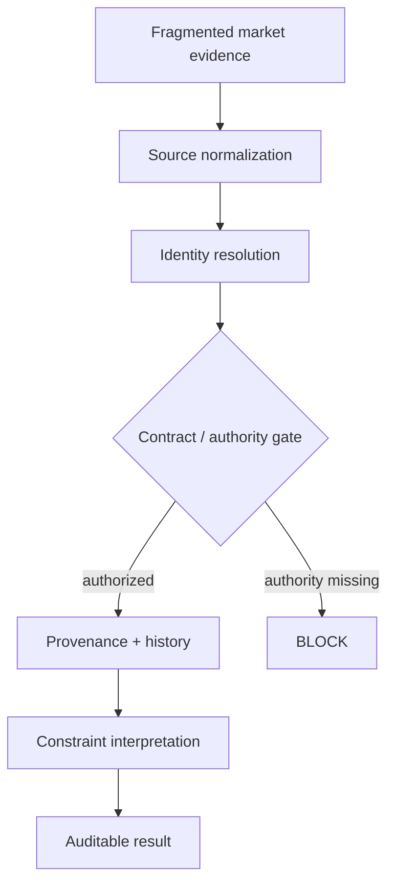

# HYDRA

**Market Intelligence & Data Engineering System**

> Turn fragmented market data into traceable intelligence.

**Public repository:** https://github.com/HYDRADATAAI/Hydra-Website
**Core engineering repository:** https://github.com/HYDRADATAAI/Hydra  
**Release note:** this README is the recruiter-facing repository front door; website deployment state is tracked separately from local release-candidate packaging.

HYDRA is a data-engineering portfolio project built around controlled ingestion, explicit contracts, deterministic identity, provenance, lineage, and auditable downstream decisions. The public repository path is intentionally compact: it shows the architecture and the strongest inspectable proof without exposing internal version archaeology as the front door.

## What it does

HYDRA models a pipeline that moves fragmented market, reference, and historical evidence through controlled normalization, identity resolution, contract/authority gates, provenance/history linkage, and downstream constraint interpretation.

A core design rule is simple: **discoverable data is not automatically authorized data**. If a downstream field has no proven owner or permitted derivation, the handoff blocks rather than inventing a value.

## Architecture


```mermaid
flowchart TD
  A[Fragmented market evidence] --> B[Source normalization]
  B --> C[Identity resolution]
  C --> D{Contract / authority gate}
  D -->|authorized| E[Provenance + history]
  D -->|authority missing| X[BLOCK]
  E --> F[Constraint interpretation]
  F --> G[Auditable result]
```

See [`docs/ARCHITECTURE.md`](docs/ARCHITECTURE.md).

## Data flow

`source evidence → normalized records → canonical identity → authority check → lineage/history → constraint interpretation → auditable result`

## Engineering principles

- explicit authority and field ownership;
- deterministic identity and bounded canonicalization;
- provenance and forward/reverse lineage;
- contract-bound handoffs;
- testable, replayable transformations;
- quarantine and release-gate propagation;
- minimum defect-scoped repair;
- **blocked rather than fabricated outputs**.

## Technical proof

The public proof path deliberately uses small artifacts rather than giant logs.

| Evidence | Public label | Engineering lesson |
|---|---|---|
| `evidence/CI_TEST_004_PUBLIC_EXCERPT.json` | SYNTHETIC / SHADOW | A named cross-component defect was repaired and rerun to PASS without mutating the canonical baseline. |
| `evidence/CI_TEST_006_PUBLIC_EXCERPT.txt` | SYNTHETIC / SHADOW | A quarantined upstream object remained blocked through the downstream release gate while lineage/provenance were preserved. |
| `evidence/CI_TEST_008_PUBLIC_EXCERPT.json` | SHADOW | Required handoff semantics lacked proven authority, so the pipeline blocked and invented no semantic values. |

See [`docs/EVIDENCE_INDEX.md`](docs/EVIDENCE_INDEX.md).

### Runnable data-engineering pipeline

The core repository now also includes a runnable **SYNTHETIC / NON-LIVE** data-engineering sample:

- [`market-data-pipeline-sample/`](https://github.com/HYDRADATAAI/Hydra/tree/main/market-data-pipeline-sample) — CSV ingestion → strict contract check → normalization → deterministic identity → provenance → quarantine → JSONL / CSV;
- [`pipeline.py`](https://github.com/HYDRADATAAI/Hydra/blob/main/market-data-pipeline-sample/src/hydra_market_pipeline/pipeline.py) — row validation, source-symbol normalization, UTC normalization, provenance hashing, duplicate detection, and quarantine decisions;
- [`operations.py`](https://github.com/HYDRADATAAI/Hydra/blob/main/market-data-pipeline-sample/src/hydra_market_pipeline/operations.py) — bounded multi-partition backfills, atomic checkpoints, integrity-checked reuse, deterministic metrics, and explicit local SLIs;
- [`test_pipeline.py`](https://github.com/HYDRADATAAI/Hydra/blob/main/market-data-pipeline-sample/tests/test_pipeline.py) — deterministic rerun, CSV/JSONL equivalence, provenance, quarantine, no-silent-loss, and file-level contract tests;
- [`test_operations.py`](https://github.com/HYDRADATAAI/Hydra/blob/main/market-data-pipeline-sample/tests/test_operations.py) — interrupted resume, byte-identical recovery, idempotent replay, tamper rejection, row accounting, and budget enforcement;
- [`test_contract_files.py`](https://github.com/HYDRADATAAI/Hydra/blob/main/market-data-pipeline-sample/tests/test_contract_files.py) — proves the committed input/output contract files match runtime-required CSV columns and emitted normalized/quarantine record shapes;
- [Market data pipeline CI](https://github.com/HYDRADATAAI/Hydra/actions/workflows/market-data-pipeline.yml) — runs directly from committed source, executes the synthetic fixture, verifies the manifest, and publishes generated outputs as a workflow artifact.

The primary committed fixture produces **3 accepted / 4 quarantined** rows by design. The two-partition recovery plan produces deterministic local operations receipts and proves replay behavior under an injected interruption. Contract files are regression-tested against runtime behavior so the public schemas cannot silently drift away from the implementation. The sample is evidence of pipeline engineering and local recovery behavior, not a live market-data feed or production SLO evidence.

### Runnable SQL data-quality proof

The core repository also includes a bounded **SYNTHETIC / NON-LIVE** SQLite sample:

- [`sql-data-quality-sample/`](https://github.com/HYDRADATAAI/Hydra/tree/main/sql-data-quality-sample) - raw table -> alias join -> normalized view -> quality checks -> accepted/quarantine views -> analytical summary;
- [`02_quality.sql`](https://github.com/HYDRADATAAI/Hydra/blob/main/sql-data-quality-sample/sql/02_quality.sql) - CTE and `ROW_NUMBER` logic for explicit duplicate and malformed-record classification;
- [`03_analytics.sql`](https://github.com/HYDRADATAAI/Hydra/blob/main/sql-data-quality-sample/sql/03_analytics.sql) - `LAG`, windowed averages, grouped quality counts, and symbol-level summaries;
- [`test_sql_sample.py`](https://github.com/HYDRADATAAI/Hydra/blob/main/sql-data-quality-sample/tests/test_sql_sample.py) - regression coverage for accepted/quarantine counts, reason codes, alias joins, and analytical output;
- [SQL data quality CI](https://github.com/HYDRADATAAI/Hydra/actions/workflows/sql-data-quality-sample.yml) - runs the sample tests on Python 3.11 with no service or network dependency.

The committed fixture produces **5 accepted / 3 quarantined** rows. This is inspectable SQL and relational data-quality evidence, not a production database, warehouse, or live market-data system.

### Governed intelligence context, lexical retrieval, and structured grounding proof

The core repository also includes a **SYNTHETIC / NON-LIVE / MODEL NOT EXECUTED** downstream control sample, pinned here to merge commit [`6dd79a85cdba1f2cd90c2e8815f6d881ac73efad`](https://github.com/HYDRADATAAI/Hydra/commit/6dd79a85cdba1f2cd90c2e8815f6d881ac73efad):

- [`governed-intelligence-sample/`](https://github.com/HYDRADATAAI/Hydra/tree/6dd79a85cdba1f2cd90c2e8815f6d881ac73efad/governed-intelligence-sample) - integrity-checked pipeline artifacts -> bounded context -> lexical retrieval -> structured grounding -> deterministic receipts;
- [`context.py`](https://github.com/HYDRADATAAI/Hydra/blob/6dd79a85cdba1f2cd90c2e8815f6d881ac73efad/governed-intelligence-sample/src/hydra_governed_intelligence/context.py) - digest-bound accepted-record context, aggregate-only quality context, exact citations, and explicit control outcomes;
- [`retrieval.py`](https://github.com/HYDRADATAAI/Hydra/blob/6dd79a85cdba1f2cd90c2e8815f6d881ac73efad/governed-intelligence-sample/src/hydra_governed_intelligence/retrieval.py) and [`retrieval_evaluation.py`](https://github.com/HYDRADATAAI/Hydra/blob/6dd79a85cdba1f2cd90c2e8815f6d881ac73efad/governed-intelligence-sample/src/hydra_governed_intelligence/retrieval_evaluation.py) - accepted-only weighted lexical ranking, exact citation recomputation, and deterministic qrel evaluation;
- [`retrieval_cases.json`](https://github.com/HYDRADATAAI/Hydra/blob/6dd79a85cdba1f2cd90c2e8815f6d881ac73efad/governed-intelligence-sample/fixtures/retrieval_cases.json) and [`retrieval_qrels.json`](https://github.com/HYDRADATAAI/Hydra/blob/6dd79a85cdba1f2cd90c2e8815f6d881ac73efad/governed-intelligence-sample/fixtures/retrieval_qrels.json) - inspectable behavior cases and separately committed qrels, independent of the behavior cases, containing record-level relevance judgments;
- [`grounding.py`](https://github.com/HYDRADATAAI/Hydra/blob/6dd79a85cdba1f2cd90c2e8815f6d881ac73efad/governed-intelligence-sample/src/hydra_governed_intelligence/grounding.py) and [`grounding_cases.json`](https://github.com/HYDRADATAAI/Hydra/blob/6dd79a85cdba1f2cd90c2e8815f6d881ac73efad/governed-intelligence-sample/fixtures/grounding_cases.json) - exact claim, value, record, and citation checks over committed candidate fixtures;
- [`pre_upload_verifier.py`](https://github.com/HYDRADATAAI/Hydra/blob/6dd79a85cdba1f2cd90c2e8815f6d881ac73efad/governed-intelligence-sample/src/hydra_governed_intelligence/pre_upload_verifier.py) and [`test_pre_upload_verifier.py`](https://github.com/HYDRADATAAI/Hydra/blob/6dd79a85cdba1f2cd90c2e8815f6d881ac73efad/governed-intelligence-sample/tests/test_pre_upload_verifier.py) - final receipt revalidation, independent metric recomputation, and deterministic artifact packaging;
- [pinned workflow source](https://github.com/HYDRADATAAI/Hydra/blob/6dd79a85cdba1f2cd90c2e8815f6d881ac73efad/.github/workflows/governed-intelligence-sample.yml) and [successful run `37170895042`, attempt 1](https://github.com/HYDRADATAAI/Hydra/actions/runs/37170895042/attempts/1) - rebuild, verify, publish, download, and digest-check the exact proof package.

Verified retrieval metrics: 13 retrieval cases; 4 `ADMIT` / 6 `ABSTAIN` / 3 `REFUSE`; 0.444444 micro Recall@k; 0.583333 macro Recall@k; 0.666667 MRR.

Verified grounding metrics: 8 grounding cases; 1 `ADMIT` / 5 `QUARANTINE` / 1 `ABSTAIN` / 1 `REFUSE`.

Verified package facts: 9 manifested outputs; 26 receipts; 2 verified input snapshots; 7 independently replayed source rows; 15 bundle members; 41,833 bytes; inner SHA-256 `2b52498e8dfba5f86cf694b08833bbbd67464c91e5cbf6fbd49cd37b1a0698a6`.

The proof bundle includes `source_snapshot.csv` and `resolved_symbol_aliases.json`. The source snapshot contains all seven synthetic rows, including quarantine-designed rows. Governed contexts and receipts remain accepted-only or aggregate-only and do not expose quarantined row payloads.

Candidate responses are committed synthetic fixtures, not model output. Retrieval is lexical, not semantic or embedding retrieval. There is no model or agent execution and no external action. These runs are repository-controlled evidence, not independent attestation or a trust anchor; they do not establish model quality, production inference, autonomous analysis, investment advice, or trading authorization.

### Inspectable implementation

The small public receipts above are paired with a focused source example in the core repository:

- [`t6-fail-closed-validator/`](https://github.com/HYDRADATAAI/Hydra/tree/main/t6-fail-closed-validator) — source-only, dormant fail-closed validator component;
- [`handoff.py`](https://github.com/HYDRADATAAI/Hydra/blob/main/t6-fail-closed-validator/src/hydra_t6_failclosed/handoff.py) — candidate-only handoff validation and authority-smuggling detection;
- [`test_camelcase_smuggling.py`](https://github.com/HYDRADATAAI/Hydra/blob/main/t6-fail-closed-validator/tests/test_camelcase_smuggling.py) — focused regression proof.

The component is intentionally presented as inspectable source, not as an activated live production runtime.

## Representative constraint example

The website includes a **REPRESENTATIVE / NON-LIVE** constraint walkthrough:

`fragmented evidence → normalize → identity → authority → provenance/history → interpretation → result`

The example demonstrates a bounded conclusion: evidence may support a local bottleneck without justifying a broader systemic shortage claim. The case study is intentionally representative and is not presented as live production detection.

Open `constraint-case-study-v2.html` in the website export for the full walkthrough.

## Testing

Public-safe control evidence demonstrates patterns including:

- integrated seam validation;
- bounded repair + rerun;
- deterministic regeneration/replay;
- quarantine propagation;
- forward and reverse lineage checks;
- baseline immutability pins;
- fail-closed authority checks.

## Real vs synthetic

Public labels are mandatory, not cosmetic.

- **REPRESENTATIVE**: illustrative market evidence, normalization, identity mapping, and constraint output used in the case study.
- **SYNTHETIC / NON-LIVE**: the synthetic Python pipeline, checkpoint-recovery path, SQLite quality sample, and governed context, lexical-retrieval, structured-grounding, and deterministic-package evaluations shown as technical proof.
- **SYNTHETIC / SHADOW**: the CI-004 and CI-006 control-plane receipts.
- **SHADOW**: the CI-008 authority-block control receipt.
- **NOT CLAIMED**: live production operation, production SLO attainment, deployed orchestration, a production database or warehouse, proven real-world constraint detection, production promotion, model quality, semantic or embedding retrieval, production inference, model or agent execution, external action, or independent attestation.

See [`docs/REAL_VS_SYNTHETIC.md`](docs/REAL_VS_SYNTHETIC.md).

## Repository map

```text
README.md                         recruiter front door
docs/ARCHITECTURE.md             public architecture
docs/EVIDENCE_INDEX.md           proof guide
docs/REAL_VS_SYNTHETIC.md        claim boundary
docs/PUBLIC_CLAIM_BOUNDARIES.md  public language controls
evidence/                         public-safe receipts
constraint-case-study-v2.html    representative case study
index.html                       recruiter website front door
```

## Run / demo path

This public export is a **static inspectable portfolio surface**, not a claim of a live production runtime.

1. Open `index.html`.
2. Use the 30–90 second technical proof strip.
3. Open `constraint-case-study-v2.html` for the full source-to-result walkthrough.
4. Inspect the three public-safe receipts under `evidence/`.
5. Open the runnable [`market-data-pipeline-sample/`](https://github.com/HYDRADATAAI/Hydra/tree/main/market-data-pipeline-sample) for the ingestion → normalization → provenance → quarantine → deterministic artifact path.
6. Inspect [`operations.py`](https://github.com/HYDRADATAAI/Hydra/blob/main/market-data-pipeline-sample/src/hydra_market_pipeline/operations.py) and [`test_operations.py`](https://github.com/HYDRADATAAI/Hydra/blob/main/market-data-pipeline-sample/tests/test_operations.py) for checkpoint, recovery, replay, integrity, SLI, and budget behavior.
7. Open [`sql-data-quality-sample/`](https://github.com/HYDRADATAAI/Hydra/tree/main/sql-data-quality-sample) for the relational quality, joins, CTEs, and window-function path.
8. Open the commit-pinned [`governed-intelligence-sample/`](https://github.com/HYDRADATAAI/Hydra/tree/6dd79a85cdba1f2cd90c2e8815f6d881ac73efad/governed-intelligence-sample) for integrity-checked context, accepted-only lexical ranking, separately committed qrels, independent of the behavior cases, exact citations, structured-grounding receipts, and deterministic proof packaging.

No runnable live-data demo is manufactured here merely to make the repository look more complete.


## Historical material

Historical release, audit, verification, build-report, and packaging artifacts are retained under `archive/` for traceability. They are intentionally kept out of the recruiter-facing repository root.

## Maintenance guard

The recruiter-facing surface is protected by deterministic CI. [Public surface validation](https://github.com/HYDRADATAAI/Hydra-Website/actions/workflows/public-surface-validation.yml) checks required evidence/routes, relative HTML/Markdown/CSS links, stale public wording, and historical build artifacts returning to the repository root.
